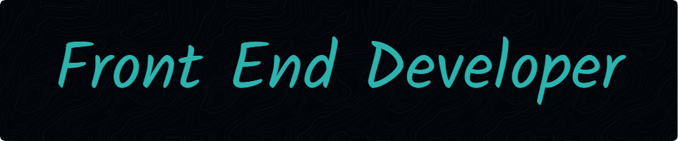

###
<h4 align="left">Hello everyone! I'm Andres, a dedicated front-end developer from Argentina. I thrive on creating innovative solutions to real-world problems. Beyond coding, I find joy in helping others and enjoying every step of the development journey.</h4>

###

  
  
  
  
  
  
  
  
  
  
  
  
  
  
  
  
  
  
  
  
  
  
  
  
  
  
  
  
  
  
  

###

  

###
